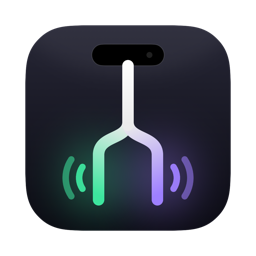
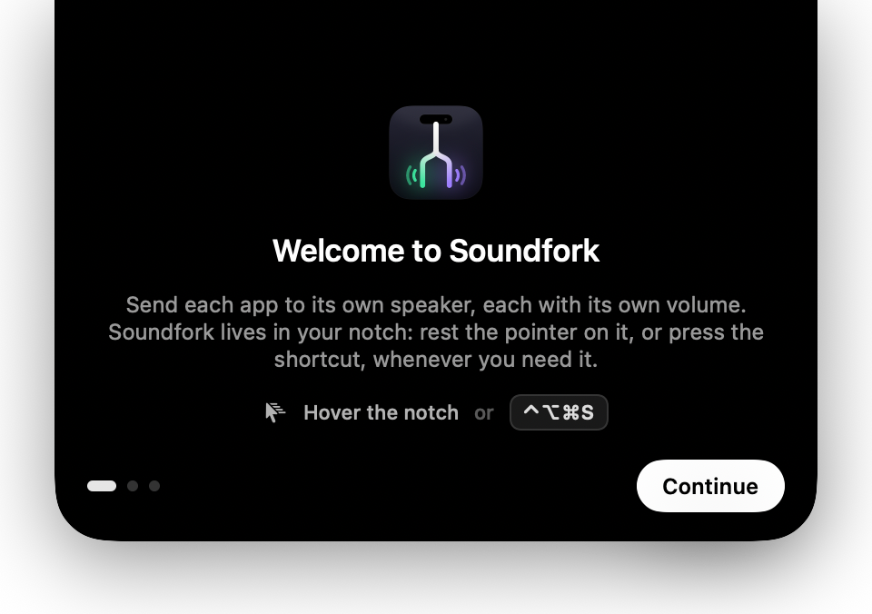
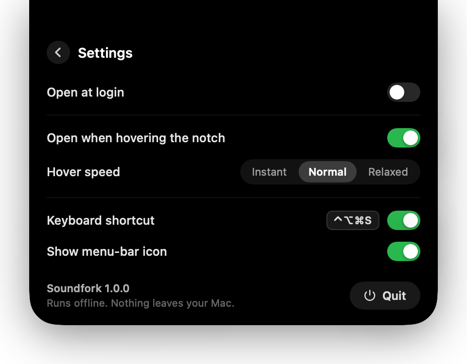

<p align="center">
  
</p>

<h1 align="center">Soundfork</h1>

<p align="center">
  <b>Send each app to its own speaker, right from your Mac's notch.</b><br>
  Spotify on the Bluetooth speaker. YouTube on the laptop. Each with its own volume.
</p>

<p align="center">
  
  
</p>

---

## What it does

macOS sends every app to the same output. Soundfork lets you pick an output **per app**:

```
🎵 Spotify        →  🔵 Bluetooth speaker
🌐 Chrome         →  💻 MacBook Pro Speakers
🎬 IINA           →  💻 MacBook Pro Speakers   · 40%
```

- **Per-app output.** Pick any speaker, headphones, AirPods, USB interface or display for any app.
- **Per-app volume.** Each app has its own slider, which scales within the Mac's main volume (main at 50% and app at 100% plays at 50%).
- **Lives in the notch.** Rest the pointer on the notch (or press **⌃⌥⌘S**) and a dynamic-island panel grows out of it. Move away and it tucks itself back in.
- **Remembers everything.** Routes and volumes come back after restarts, relaunches and reconnects.
- **Handles speakers coming and going.** If a speaker disconnects, its apps fall back to the default output at the same volume, then move back when it reconnects.
- **Quiet.** No Dock icon, no windows, no notifications. It can open at login and stay out of the way.
- **Private and offline.** No network access at all. Audio is redirected, never recorded.

## Requirements

- macOS 26 or later
- A Mac with a notch works best; on other displays the island opens from the top-center of the screen.

## Install

### Download

1. Download `Soundfork.zip` from the [latest release](../../releases/latest) and unzip it.
2. Drag **Soundfork.app** into **Applications** and open it.
3. The first time, macOS says it can't verify the developer, because Soundfork isn't notarized by Apple. To open it anyway:
   - Go to **System Settings → Privacy & Security**, scroll down and click **Open Anyway**, **or**
   - run `xattr -dr com.apple.quarantine /Applications/Soundfork.app` in Terminal.

   You only need to do this once.
4. The welcome screen asks for **audio access**. Choose **Allow**; Soundfork needs it to move an app's audio to another device.

### Build from source

Needs Xcode 27 (Swift 6.4).

```bash
git clone <this repo>
cd soundfork
./scripts/install.sh      # builds, installs to /Applications and launches
```

The build is signed with an Apple Development identity from your keychain if you have one, otherwise ad-hoc. To use a different one, set `SIGN_IDENTITY` (a certificate SHA-1 or name). Use `SIGN_IDENTITY=-` for an ad-hoc signature.

## Using it

| To | Do |
|---|---|
| Open the island | Rest the pointer on the notch, press **⌃⌥⌘S**, or click the fork icon in the menu bar |
| Move an app | Tap the device chip on its row and pick an output |
| Change an app's volume | Drag its slider |
| Put an app back to normal | Pick **System default** at 100% |
| Change the Mac's output or volume | Use the **Output** section at the top |
| Settings, quit | Gear icon in the island's footer, or right-click the menu-bar icon |

Apps show up in the island while they're playing, or after you've changed them. **Other apps** lists the rest.

## How it works

Soundfork uses **Core Audio process taps** (macOS 14.2+), the same public API screen recorders use to capture app audio. There is no audio driver, kernel extension or virtual device to install.

For each app you route:

1. A **process tap** captures the app's audio and mutes its normal output.
2. A **private aggregate device** combines that tap with the speaker you picked, so both run on one clock. macOS handles sample-rate differences, e.g. 48 kHz apps to a 44.1 kHz Bluetooth speaker.
3. A tiny real-time callback copies the audio across and applies the app's volume, ramping smoothly between changes.

If Soundfork quits or crashes, the taps disappear with it and every app plays normally again. Nothing gets stuck muted.

More detail is in [docs/ARCHITECTURE.md](docs/ARCHITECTURE.md).

## Limitations

- **Stereo only.** Multichannel devices get audio on their first two channels.
- **Safari and other WebKit apps share one audio process**, so routing Safari also moves Mail's and other WebKit apps' sounds.
- **Per-tab routing** in browsers isn't possible; a browser moves as a whole.
- Apps that take **exclusive ("hog mode") control** of a device can't be redirected.

## Privacy

Soundfork makes no network connections, and has no analytics, crash reporting or update checks. The audio-capture permission is used only to move audio between devices on your Mac; nothing is stored or sent anywhere. Your choices are saved in `~/Library/Preferences/com.delightsheriff.Soundfork.plist`.

## Development

```bash
swift build                          # compile everything
swift test                           # unit tests
./scripts/build-app.sh               # build/Soundfork.app
./scripts/install.sh                 # install to /Applications and relaunch
swift scripts/make-icon.swift        # re-render the app icon
./scripts/spike.sh --list            # list devices and audio processes
```

Logs: `log stream --level info --predicate 'subsystem == "com.delightsheriff.Soundfork"'`

Manual test checklist: [docs/TESTS.md](docs/TESTS.md). Design decisions: [docs/DECISIONS.md](docs/DECISIONS.md).

## License

[MIT](LICENSE) © 2026 Delight Sheriff
